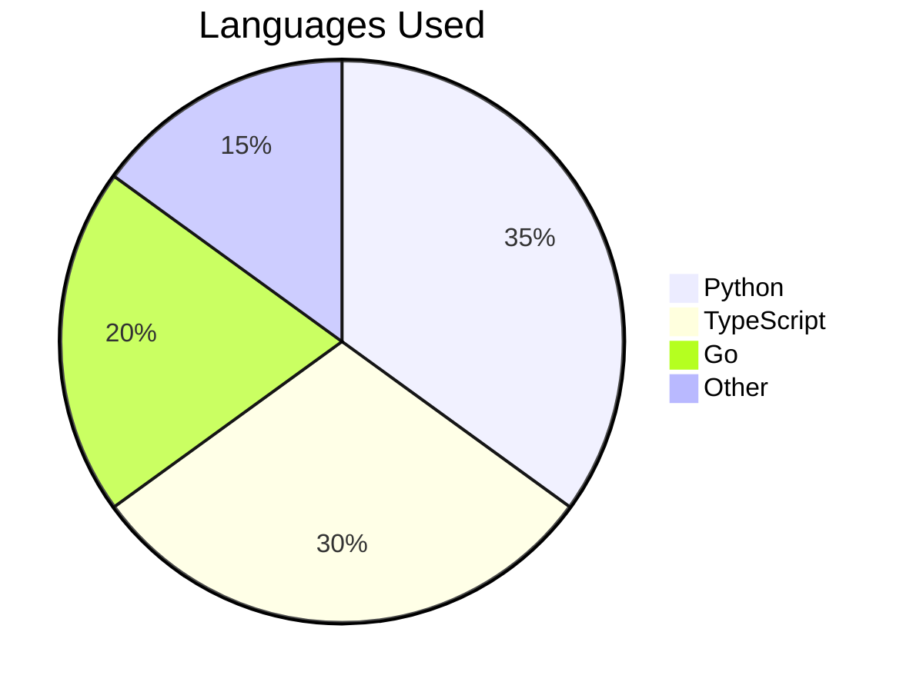

# Kiran Dev 👨‍💻

[](https://github.com/yourusername)
[](https://linkedin.com/in/yourusername)
[](https://twitter.com/yourusername)

> *"Building the future, one line of code at a time! 🚀"*

## 🎯 About Me

```typescript
const developer = {
    name: "Kiran Dev",
    location: "United States 🇺🇸",
    role: "Senior Full Stack Developer",
    specializations: ["Cloud Architecture", "AI/ML", "System Design"],
    currentFocus: [
        "Microservices Architecture",
        "Kubernetes Orchestration",
        "AI Integration"
    ],
    communities: {
        founder: ["Tech Innovators Hub"],
        contributor: ["OpenSource Alliance", "AI Developers Network"]
    },
    motto: "Transform ideas into impactful solutions 💡"
};
```

## 🛠️ Tech Arsenal

### Core Technologies


### Web & Framework Expertise


### Cloud & DevOps


## 📊 GitHub Analytics

<div align="center">
  
  
</div>

### 🎯 Top Languages


## 🤝 Let's Connect & Collaborate

[](https://yourportfolio.com)
[](https://linkedin.com/in/yourusername)
[](https://twitter.com/yourusername)

### 💡 Current Projects
- 🤖 AI-Powered Code Review Assistant
- 🚀 Microservices Framework
- 📊 Real-time Analytics Platform

---

<div align="center">
  
### 🎯 Open for collaboration on AI, Cloud Architecture, and Open Source Projects!
  

</div>
